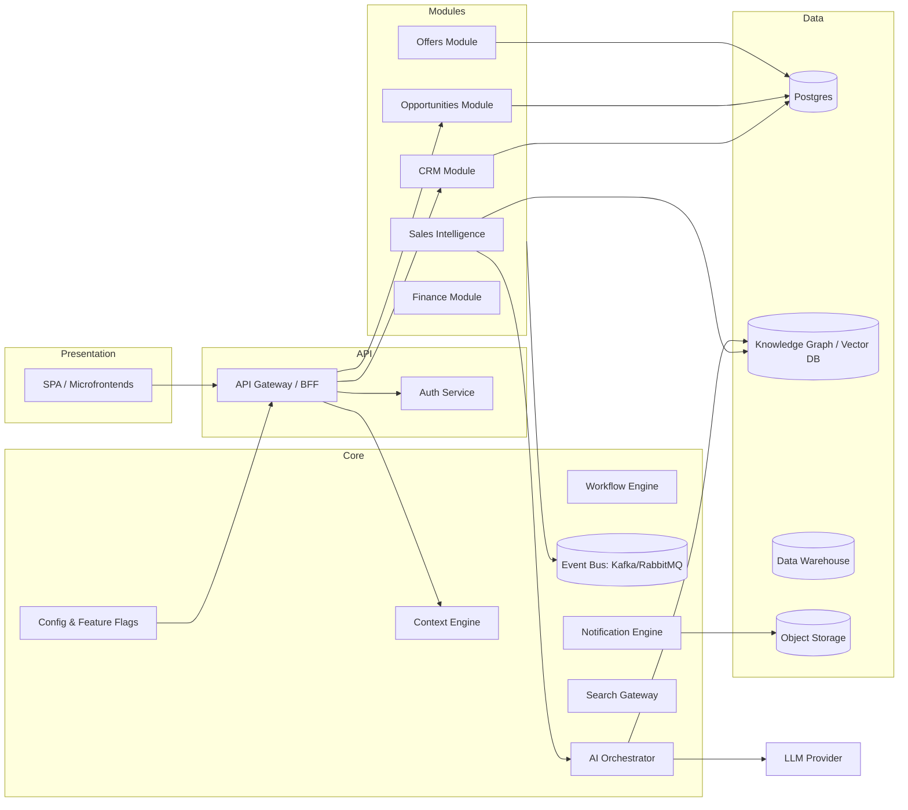
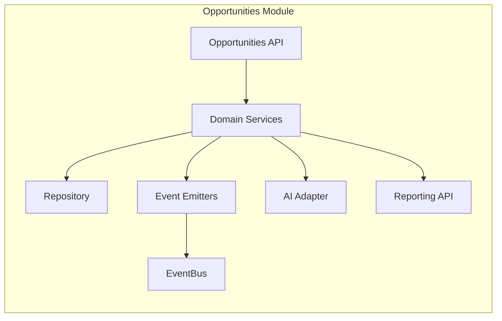
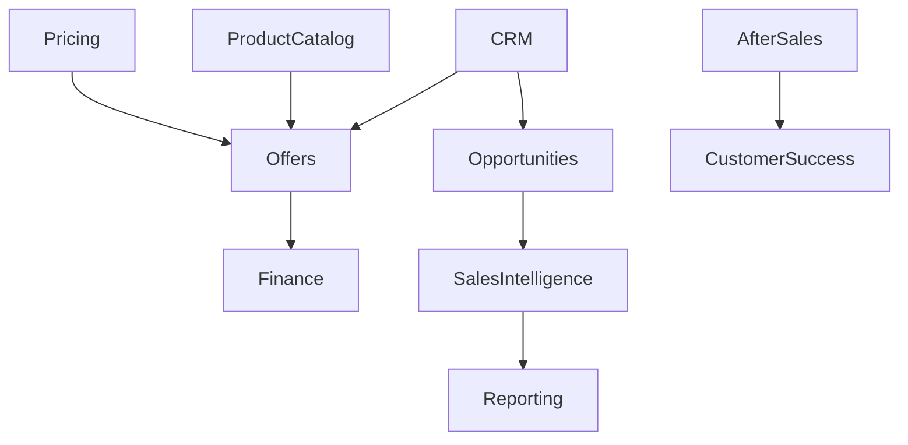
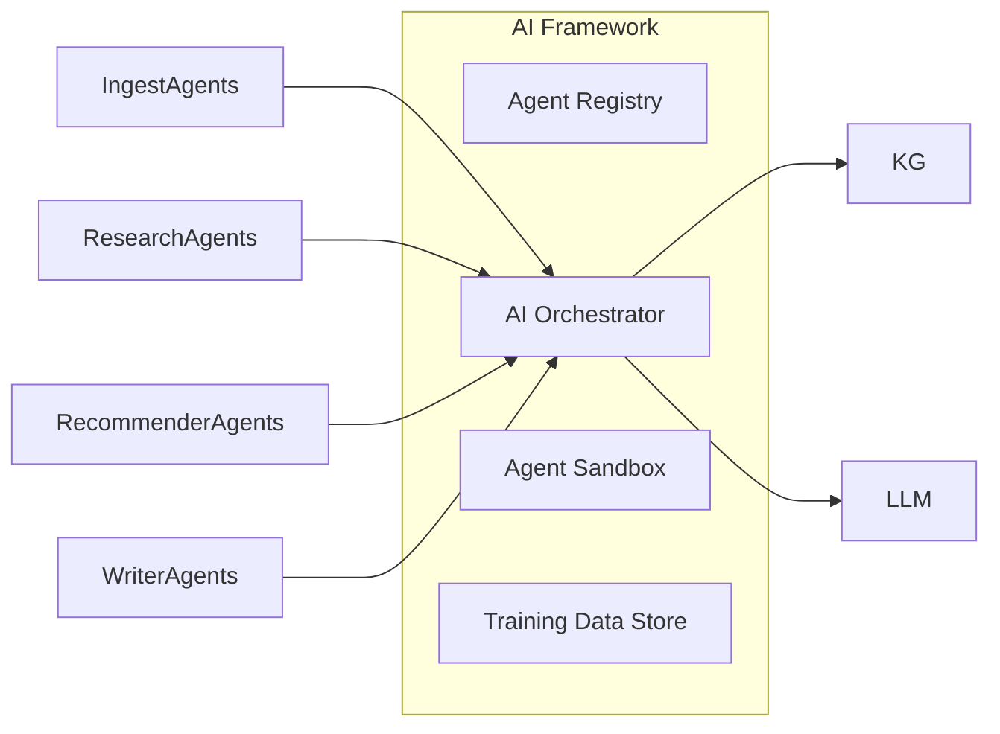
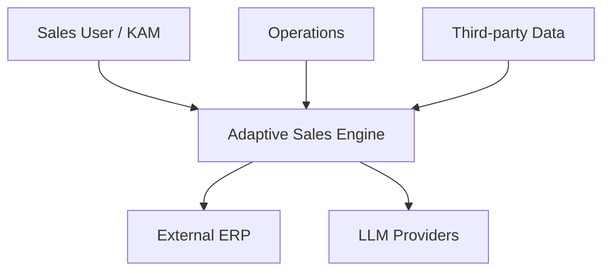
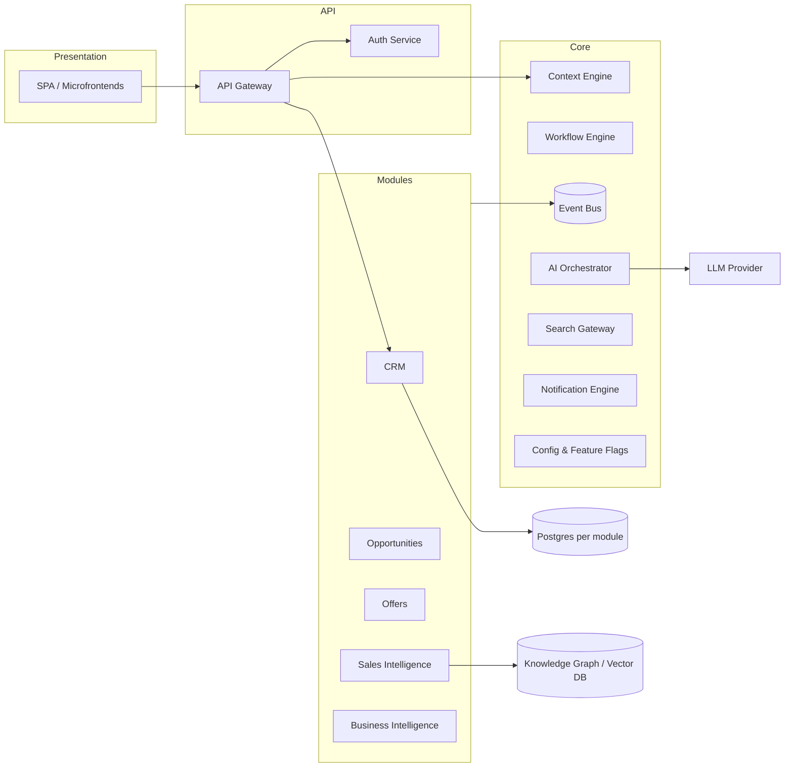
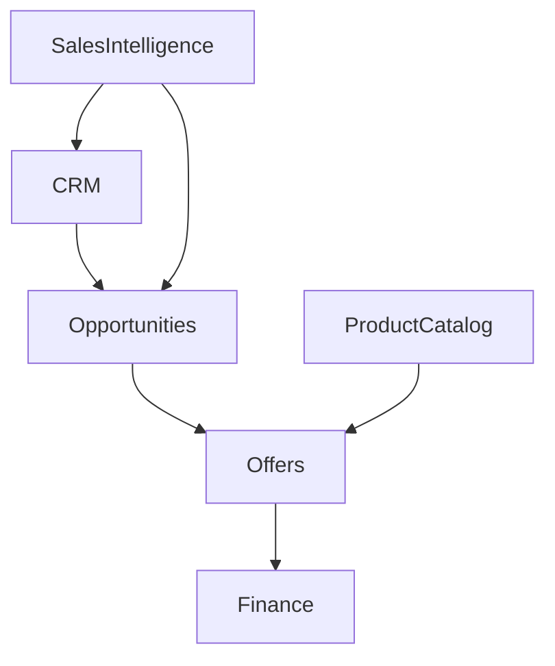
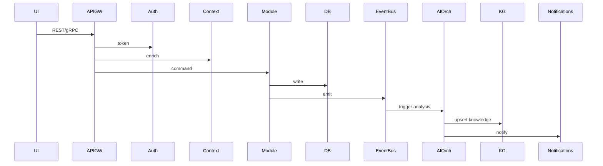
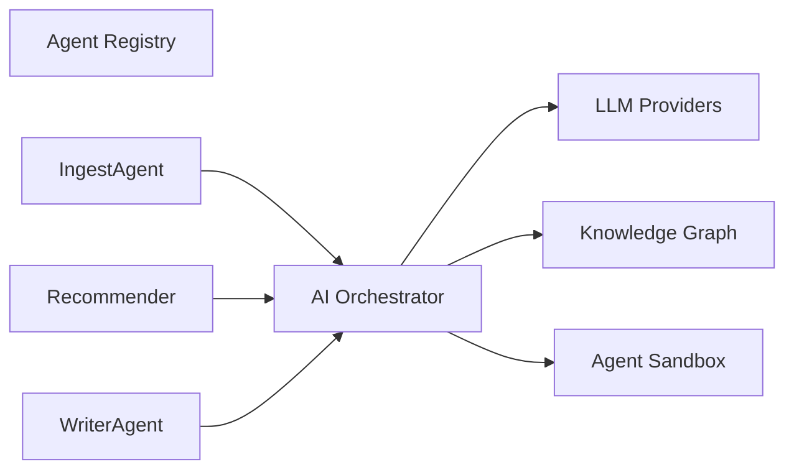
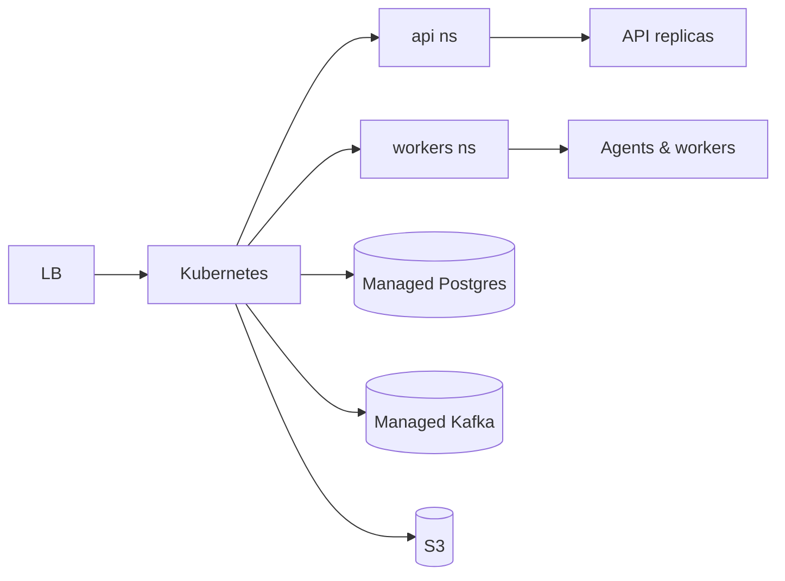

# Adaptive Sales Engine — To‑Be Architecture

Date: 2026-06-29

Purpose
-------
Define the definitive target architecture for the Adaptive Sales Engine (ASE) as an Enterprise Business Platform composed of reusable Business Modules built on top of a common Core Platform. This document captures Product Vision, Boundaries, Architecture Diagrams (Mermaid), Core responsibilities, Business Modules, AI Framework, Data and UI architecture, ADRs, Migration Roadmap, Governance and Long‑Term Vision.

1) Product Vision
-----------------
- The Adaptive Sales Engine is an Enterprise Business Platform that enables companies to orchestrate, automate and optimize the full sales lifecycle (prospect → opportunity → offer → contract → delivery → renewal) by combining: reusable business modules, an event‑driven Core Platform, a pluggable AI Framework, and a lightweight Presentation Layer. ASE is NOT a Streamlit app, CRM, or a set of detached AI agents — it is the enterprise-grade platform that exposes productized, versioned, and governed business capabilities as services so that interfaces, automation, reporting and AI augmentation are composable and repeatable across customers.

Key principles
- Clear separation: Core Platform provides horizontal technical capabilities only (no business logic).
- Module ownership: Business Modules contain domain logic and own their data.
- Event‑driven integration: asynchronous events + canonical entities + durable storage.
- AI as a first‑class capability: agents are registered, versioned and orchestrated via the AI Framework.
- Observability, governance and reproducible deployments.

2) Product Boundaries
---------------------
Precise decomposition (no ambiguity):

- Core Platform (horizontal technical services — NO business logic):
  - Authentication & Identity (OAuth2/OIDC, SSO)
  - Authorization (RBAC/ABAC, policy engine)
  - Context Engine (session/context propagation, tenant resolution)
  - Workflow Engine (durable orchestrations, state machines)
  - Event Bus (pub/sub, durable streaming)
  - Notification Engine (channels, templates)
  - Recommendation Engine (scoring/feature APIs — pluggable models)
  - Reporting Engine (scheduling + report execution primitives)
  - Search Engine (text + vector search gateway)
  - AI Orchestrator (agent registry, routing, observability)
  - Configuration Management (centralized config + secrets pointers)
  - Feature Flags service
  - Shared UI component library (pure presentation)
  - Shared Services (logging, metrics, tracing, monitoring)

- Business Modules (vertical, own data and business logic):
  - CRM, Opportunities, Offers, Requests, Key Account Management, Sales Intelligence, Business Intelligence, After Sales, Finance, ERP Adapter, Customer Success, Product Strategy, Administration. Each module: domain model + REST/gRPC + event handlers + tests + ownership.

- Shared Services (domain‑agnostic but not Core):
  - Product Catalog, Pricing Engine (domain service), Document Store, Media Processing, Integration Connectors (ERP, Email, Payment), Vector DB, Knowledge Graph (semantic store).

- AI Framework (first‑class platform component):
  - Agent Registry, Agent Lifecycle, Agent Sandbox/Versioning, Training data store, Model artifacts, Safety & usage policies, Audit logs.

- Infrastructure (deployable components & infra patterns):
  - Kubernetes, Managed DBs, Message Broker, Object Storage, CDN, Secrets Manager, CI/CD pipelines, Observability stack, IAM.

- Presentation Layer (purely UI/UX):
  - Single Page Apps or Micro‑frontends, Mobile clients. All UI elements call API surface provided by Core + Modules. No business logic beyond view composition and client-side validation.

3) Overall Architecture (diagrams)
---------------------------------

System Context (Mermaid)

```mermaid
graph TB
  A[Sales User / KAM] -->|uses| ASE[Adaptive Sales Engine]
  B[Sales Ops] -->|configures| ASE
  C[External ERP / MRP] -->|syncs| ASE
  D[LLM Provider(s)] -->|LLM API| ASE
  E[Third-party Data: Market, Enrichment] -->|ingest| ASE
  ASE -->|reports| BI[Executive Dashboard]
  ASE -->|events| EventBus[(Event Bus)]
  ASE -->|documents| ObjectStore[(Object Storage)]
```

Container Diagram (Mermaid)



Component Diagram (example: Opportunities Module)



Module Dependency Diagram



Data Flow (Mermaid)


AI Agent Interaction Diagram



Deployment Diagram (Mermaid)

```mermaid
graph LR
  LB[Load Balancer] --> K8s[Kubernetes Cluster]
  K8s --> API_NS[namespace: api]
  K8s --> WORKER_NS[namespace: workers]
  K8s --> AI_NS[namespace: ai]
  API_NS --> APISvc[APIs (replicas)]
  WORKER_NS --> Workers[Async Workers]
  AI_NS --> AIWorkers[Agent Containers]
  K8s --> DB[(Managed Postgres)]
  K8s --> MQ[(Managed Kafka)]
  K8s --> OBJ[(S3)]
  ExtLLM --> AI_NS
```

4) Core Platform Definition
---------------------------
The Core Platform provides horizontal services only. Responsibilities (concise):

- Authentication: SSO/OIDC provider integration, token issuance, refresh, session lifecycle.
- Authorization: Central policy engine (RBAC/ABAC), API gate enforcement, resource policies.
- Context Engine: Tenant, request context, correlation IDs, request/session metadata propagation.
- Workflow Engine: Durable state machines, long‑running flows, retries, human tasks.
- Event Bus: Pub/Sub, durable streams, schema registry, versioned events.
- Notification Engine: Channel abstraction, templating, delivery guarantees.
- Recommendation Engine: Scoring APIs and feature store adapters (pluggable ML models). No domain rules here.
- Reporting Engine: Scheduling, report execution primitives; report definitions remain in Business Modules.
- Search Engine: Centralized gateway to text + vector search (indexing adapters owned by modules).
- AI Orchestrator: Agent registration, routing, observation, sandboxing.
- Configuration Management: Centralized config (per environment/tenant) and feature flags.
- Shared UI Components: Presentational components only (no calculations or persistent state).
- Shared Services: Monitoring, logging, tracing and backup primitives.

Constraints: Core must not contain business rules or domain models. Business Modules implement domain semantics and own model migration scripts.

5) Business Modules (definition template + list)
------------------------------------------------
Each module follows the same template: Purpose, Responsibilities, Public Interfaces, Dependencies, Data Ownership, AI Capabilities.

- CRM
  - Purpose: Canonical accounts and contacts.
  - Responsibilities: Contact lifecycle, account hierarchy, basic activity logging.
  - Public interfaces: `GET/POST /crm/accounts`, `GET /crm/contacts`, events: `account.created`.
  - Dependencies: Core Auth, EventBus, Search.
  - Data ownership: Account, Contact, AccountActivity.
  - AI Capabilities: Duplicate detection, enrichment suggestions.

- Opportunities
  - Purpose: Manage opportunity pipeline and states.
  - Responsibilities: Stage transitions, probability, pipeline calculations.
  - Public interfaces: `GET/POST /opportunities`, events: `opportunity.updated`.
  - Dependencies: CRM, ProductCatalog, Core Workflow.
  - Data ownership: Opportunity, Forecast.
  - AI Capabilities: Win probability scoring, next best action recommendations.

- Offers
  - Purpose: Compose and version commercial offers.
  - Responsibilities: Offer templates, approvals, pricing proposals.
  - Public interfaces: `GET/POST /offers`, events: `offer.issued`.
  - Dependencies: ProductCatalog, Pricing Engine, Finance.
  - Data ownership: Offer, OfferLine, Terms.
  - AI Capabilities: Pricing suggestions, margin impact simulation.

- Requests
  - Purpose: Customer/field requests handling.
  - Responsibilities: Intake, SLA, routing.
  - Public interfaces: `POST /requests`.
  - Dependencies: CRM, Notification Engine.
  - Data ownership: Request, RequestLog.
  - AI Capabilities: Auto-classification, routing.

- Key Account Management
  - Purpose: Strategic account plans and playbooks.

- Sales Intelligence
  - Purpose: Market & competitor insights, enrichment and signals.
  - Responsibilities: Web scraping, enrichment ingestion, knowledge graph curation.
  - Public interfaces: `GET /si/insights`, events: `insight.created`.
  - Dependencies: AI Framework, Knowledge Graph, EventBus.
  - Data ownership: KnowledgeItem, Signal.
  - AI Capabilities: Market scoring, competitor benchmarking, executive summaries.

- Business Intelligence
  - Purpose: Aggregate analytics and dashboards (read-only APIs for UI).
  - Responsibilities: ETL to DW, KPI definitions, scheduled reports.
  - Public interfaces: `GET /bi/kpis`.
  - Dependencies: Data Warehouse, Reporting Engine.
  - Data ownership: Aggregated KPIs, scheduled report definitions.

- After Sales / Customer Success / Finance / ERP Adapter / Product Strategy / Administration
  - Follow same template: own data, emit events, provide APIs. Finance integrates with ledger and reconciliation systems; ERP Adapter owns synchronization and mapping.

6) AI Architecture (Agent Framework)
-----------------------------------
Core elements:
- Agent Registry: central catalog of agents (id, version, category, owner, inputs, outputs, endpoint/invoke method, maturity, tests). See `Architecture/AGENT_REGISTRY.md` for starter entries.
- Agent Categories:
  - Ingestion Agents, Research Agents, Analysis Agents, Recommender Agents, Writer/Reporting Agents, Simulation Agents, Orchestration Agents.
- Agent Lifecycle: register → validate (unit/integration) → sandboxed deploy → monitor → version → retire.
- Agent Communication Model:
  - Event-driven notifications for asynchronous work.
  - Request/response via AI Orchestrator for synchronous interactions (timeouts, retries, fallback policies).
  - All agent outputs must be persisted (Knowledge Graph or Event Store) and observable.
- Agent Capability Matrix: map agent to abstract capabilities (ingest, extract, summarize, recommend, plan, simulate).
- Agent Dependency Map: agents can depend on the Knowledge Graph, Vector DB, or other agents; dependencies must be declared in registry to avoid cycles.

Consolidation notes
- Duplicate agents (e.g., multiple research/extraction agents across `agents/knowledge_intelligence` and `agents/competitive_intelligence`) should be consolidated into shared capability‑centric agents with module adapters: one `web_research` ingestion agent with configurable pipelines, one `knowledge_builder` that normalizes and upserts knowledge into the KG.

7) Data Architecture
--------------------
Canonical entities (single source of truth owners indicated):

- `Account` (owner: CRM)
- `Contact` (owner: CRM)
- `Product` (owner: Product Catalog)
- `Opportunity` (owner: Opportunities)
- `Offer` (owner: Offers)
- `Sale` (owner: Finance)
- `Document` (owner: Document Store module)
- `KnowledgeItem` (owner: Sales Intelligence / Knowledge Graph)
- `SimulationScenario` / `SimulationResult` (owner: Simulation Module)

Database boundaries
- Prefer DB‑per‑module pattern (schema or separate DBs) for write isolation and migration independence, with EventBus used for propagation to other modules. A central canonical Postgres (or schema) can host cross‑entity views for BI.

Integration points
- ERP/Financial systems (synchronous or scheduled sync)
- Data Warehouse for historical analytics
- External enrichment/market data

Data ownership rules
- Every entity has exactly one owning module; updates must be performed by the owner.
- Cross‑module reads are allowed; writes must be via owner APIs or through events.

8) UI Architecture (Presentation Layer)
-------------------------------------
Principles
- Purely presentation, thin clients. UI components must be stateless, call module APIs for any business action, and not implement domain rules.

Navigation & Workspaces
- Global nav: Home, Accounts, Opportunities, Offers, Intelligence, Simulator, Reports, Admin.
- Workspaces: Sales Workspace, KAM Workspace, Simulator Workbench, Intelligence Workbench.

Shared components & design
- Shared component library (no logic): buttons, forms, tables, charts, layout primitives.
- Design tokens: color, spacing, typography exposed as a single source of truth (JSON + token pipeline).

Interaction patterns
- Declarative page composition; optimistic UIs use domain events for final state.

9) Architecture Decision Records (ADRs)
-------------------------------------
Initial ADRs created under `Architecture/ADRs/`:
- `0001-modular-architecture.md` — adopt module ownership + DB per module.
- `0002-ai-agent-framework.md` — define agent registry & lifecycle.
- `0003-core-platform.md` — define Core responsibilities and constraints.
- `0004-event-driven-communication.md` — adopt EventBus, event schema registry.
- `0005-reporting-strategy.md` — reporting engine and DW patterns.
- `0006-ui-architecture.md` — presentation layer constraints.
- `0007-repository-organization.md` — monorepo layout + code ownership.

10) Migration Roadmap (phased)
-----------------------------
Phase 1 — Architecture Consolidation
- Objectives: freeze interfaces; create Architecture Hub; register agents; identify canonical simulation core.
- Deliverables: As‑Is + To‑Be docs, Agent Registry seed, ADRs created.
- Risks: none → documentation only.
- Exit criteria: stakeholder sign-off.

Phase 2 — Core Platform
- Objectives: build Core Platform skeleton (Auth, EventBus, Config, Context Engine).
- Deliverables: Auth service, EventBus, Config service, API Gateway.
- Risks: scope creep.
- Exit criteria: Core unit tests + integration tests with sample module.

Phase 3 — Business Modules
- Objectives: migrate one module (CRM) to new boundaries and DB‑per‑module pattern.
- Deliverables: CRM service, migrations, API, tests, event producers.
- Risks: data migration complexity.
- Exit criteria: CRM in production with backward compatibility.

Phase 4 — AI Framework
- Objectives: deploy AI Orchestrator, registry, one production agent (market intelligence) in sandbox.
- Deliverables: Agent Registry, Orchestrator, monitoring dashboards.
- Risks: model governance, costs.
- Exit criteria: production agent with SLA and audit logs.

Phase 5 — Reporting
- Objectives: deploy Reporting Engine + Data Warehouse ETL pipelines.
- Deliverables: DW tables, scheduled reports, BI views.
- Risks: data quality gaps.
- Exit criteria: validated KPI reports.

Phase 6 — Presentation Layer
- Objectives: move Streamlit/legacy UI to thin SPA that consumes module APIs.
- Deliverables: component library, workspace pages.
- Risks: UX regressions.
- Exit criteria: UI performance and accessibility tests passing.

Phase 7 — Optimization
- Objectives: scale, observability, cost optimization, ML model improvements.
- Deliverables: autoscaling, SLOs, optimization backlog.
- Exit criteria: SLOs met across core services.

11) Governance (pull request rules & checks)
-----------------------------------------
- PR must reference an ADR when introducing new architecture or module boundaries.
- No duplicated business logic across modules or Core — code owners review required.
- Every AI Agent must be declared in `Architecture/AGENT_REGISTRY.md` before merge.
- DB schema changes: update `Architecture/DATA_MODEL.md` and include migration plan + tests.
- No UI business logic: PRs affecting UI must include justification if any logic is proposed.
- Tests: unit coverage for new code, integration tests for public APIs, contract tests for event producers/consumers.
- CI: run `architecture-validator` step that checks presence of required Architecture files and basic conventions.

12) Long‑Term Vision
--------------------
Design ASE so it can evolve into an Enterprise Operating System: composable modules, open APIs, data mesh principles, pluggable AI agents, digital twin integration and workflow automation. The Core Platform must remain stable and minimal; all evolution occurs via new modules, feature flags and ADRs.

Files created alongside this document:
- `Architecture/AGENT_REGISTRY.md` — starter registry
- `Architecture/ADRs/` — initial ADRs
- `Architecture/MIGRATION_ROADMAP.md` — phased roadmap
- `Architecture/GOVERNANCE.md` — PR rules and checks
- `Architecture/DATA_MODEL.md` — canonical entities and ownership

Next steps
- Review and sign off this To‑Be doc. After approval I will expand the Agent Registry with full entries and generate concise module APIs and event schemas for Phase 1 migrations.
# Adaptive Sales Engine — To‑Be Architecture

Date: 2026-06-29

Purpose
-------
This document defines the Target Architecture for the Adaptive Sales Engine (ASE) as an Enterprise Business Platform: a composable platform of reusable Business Modules built on a minimal, horizontal Core Platform and augmented by a governed AI Framework. ASE is not a UI, CRM or a loose set of agents — it is a productized, governed platform.

1) Product Vision
-----------------
- ASE enables companies to orchestrate the full sales lifecycle (prospect → opportunity → offer → delivery → retention) using composable modules, event‑driven integration, and governed AI augmentation. The platform exposes stable, versioned business capabilities as services for internal teams and partners.

Principles
- Core contains only horizontal technical services.
- Business Modules own domain logic and data.
- AI is first-class, versioned and auditable.
- Event-driven integration and clear ownership boundaries.

2) Product Boundaries
---------------------

- Core Platform (technical horizontal services only):
  - Authentication (OIDC/SSO), Authorization (policy engine), Context Engine, Workflow Engine, Event Bus, Notification Engine, Recommendation Engine (pluggable), Reporting Engine (execution primitives), Search Gateway (text + vector), AI Orchestrator, Configuration Management, Feature Flags, Shared UI Components, Observability, CI/CD primitives.

- Business Modules (vertical, own data and domain logic):
  - CRM, Opportunities, Offers, Requests, Key Account Management, Sales Intelligence, Business Intelligence, After Sales, Finance, ERP Adapter, Customer Success, Product Strategy, Administration.

- Shared Services (domain‑agnostic but not Core):
  - Product Catalog, Pricing Engine, Document Store, Media Service, Integration Connectors, Vector DB, Knowledge Graph.

- AI Framework: Agent Registry, Agent Lifecycle, Sandbox, Model Store, Audit Log, Policies, Orchestrator.

- Infrastructure: Kubernetes (or managed), DBs, Message Broker, Object Storage, CDN, Secrets Manager, Observability, IAM.

- Presentation Layer: SPAs / Microfrontends / Mobile — thin clients that call module APIs. No business logic.

3) Overall Architecture (diagrams)
---------------------------------

System Context



Container Diagram



Component Diagram (Opportunities example)

```mermaid
graph LR
  subgraph Opportunities
    OAPI[Opportunities API]
    OService[Domain Services]
    ORepo[Repository (DB)]
    OEvents[Event Emitters]
    OAI[AI Adapter]
  end
  OAPI --> OService
  OService --> ORepo
  OService --> OEvents
  OService --> OAI
```

Module Dependency Diagram



Data Flow (high level)



AI Agent Interaction



Deployment Diagram



4) Core Platform Definition
---------------------------
The Core Platform responsibilities (no domain logic inside Core):
- Authentication: OIDC, SSO, token lifecycle
- Authorization: central policy engine (RBAC/ABAC)
- Context Engine: tenant, request/session propagation
- Workflow Engine: durable orchestrations, human tasks
- Event Bus: pub/sub, schema registry
- Notification Engine: channels, templating, delivery
- Recommendation Engine: scoring API + feature store adapters
- Reporting Engine: execution primitives and scheduler
- Search Engine: gateway to text + vector search
- AI Orchestrator: agent registry, routing, audit
- Configuration Management: central config + secrets pointers
- Feature Flags: environment and tenant flags
- Shared UI components: presentational only
- Shared Services: logging, metrics, tracing, monitoring

5) Business Modules (template + examples)
---------------------------------------
Template: Purpose; Responsibilities; Public Interfaces; Dependencies; Data Ownership; AI Capabilities.

- CRM: owner of Account, Contact. APIs: /crm/*; emits events: account.created
- Opportunities: owner of Opportunity. APIs: /opportunities/*; AI: win probability
- Offers: owner of Offer. APIs: /offers/*; AI: price suggestions
- Sales Intelligence: owner of KnowledgeItem, Signals; AI: enrichment, benchmarking
- Business Intelligence: owner of KPIs and scheduled reports; exports read-only views
- Finance: owner of Sale, Invoices; integrates with ERP/ledger
- After Sales / Customer Success / Product Strategy / Admin: follow same template

6) AI Architecture
------------------
Artifacts:
- Agent Registry: `Architecture/AGENT_REGISTRY.md` (catalog schema)
- Agent Categories: Ingest, Research, Analysis, Recommender, Writer, Simulator, Governance
- Agent Lifecycle: register → validate → sandbox → deploy → monitor → retire
- Communication: Event-driven async + sync via AI Orchestrator (with timeouts & fallbacks)
- Capability Matrix & Dependency Map: maintained in registry, required for PR approvals

Consolidation: merge duplicate research/extraction agents into unified capability agents with module adapters.

7) Data Architecture
--------------------
Canonical entities and owners (single source of truth):
- Account (CRM), Contact (CRM), Product (Product Catalog), Opportunity (Opportunities), Offer (Offers), Sale (Finance), Document (Document Store), KnowledgeItem (Sales Intelligence), SimulationScenario/Result (Simulation Module)

Database boundaries: DB per module (schemas or dedicated DBs). EventBus propagates state changes.

8) UI Architecture
------------------
- Presentation only: navigation, workspaces, shared components, layout system, design tokens, interaction patterns. No domain logic in UI.

9) Architecture Decision Records
--------------------------------
See `Architecture/ADRs/` (initial ADRs created alongside this hub).

10) Migration Roadmap
--------------------
Phases: 1 Architecture Consolidation; 2 Core Platform; 3 Business Modules (CRM first); 4 AI Framework; 5 Reporting; 6 Presentation Layer; 7 Optimization. See `Architecture/MIGRATION_ROADMAP.md` for details.

11) Governance
--------------
See `Architecture/GOVERNANCE.md` (PR rules, checks, agent registration requirement).

12) Long-Term Vision
--------------------
Platform must support ERP, Procurement, Manufacturing, Project & Service Management, Digital Twin, Enterprise AI, Knowledge Hub — through modules and stable Core primitives.

Files added with this doc: `Architecture/AGENT_REGISTRY.md`, `Architecture/ADRs/*`, `Architecture/MIGRATION_ROADMAP.md`, `Architecture/DATA_MODEL.md`, `Architecture/GOVERNANCE.md`.

Next: expand `AGENT_REGISTRY.md` entries and produce module API blueprints and event schemas for Phase 1.
