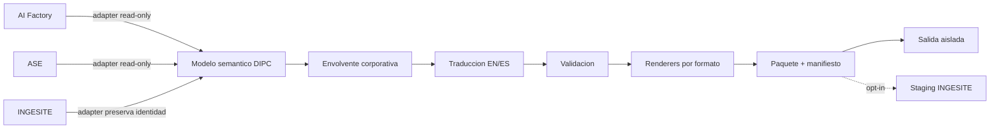

# HTML Intelligence: mapa corporativo de repositorios

## Objetivo y alcance

Este documento define la superficie autorizada de integracion de HTML Intelligence con los tres repositorios corporativos. La plataforma conserva `HtmlIntelligenceStudio` y DIPC como nucleo semantico y de publicacion; los repositorios externos aportan fuentes, plantillas, activos y destinos mediante adapters explicitos.

| Repositorio | Rol corporativo | Acceso predeterminado | Escritura autorizada |
|---|---|---|---|
| `AI-FACTORY-v2` | Conocimiento tecnico, resultados de misiones, informes de auditoria y plantilla PCG | Lectura | Solo artefactos derivados en un directorio configurado |
| `adaptive-sales-engine` | Datos comerciales, perfiles de cliente, traducciones y plantillas de negocio | Lectura | Solo artefactos derivados en un directorio configurado |
| `ingesite.github.io` | Publicacion web de producto con identidad visual nativa | Lectura | Sin sobrescritura; sincronizacion opt-in a staging |

Reglas globales:

1. Las rutas se resuelven por configuracion centralizada y variables de entorno, nunca por rutas dispersas en el codigo.
2. Cada fuente importada registra repositorio, ruta relativa, hash SHA-256, fecha de lectura y adapter.
3. Ningun adapter modifica fuentes. La publicacion escribe en un workspace aislado y genera manifiesto.
4. INGESITE conserva su CSS, estructura bilingue y archivos originales. Cualquier salida se genera como derivado revisable.
5. Una dependencia cuyo hash cambia marca el documento como `stale`; nunca se regenera o publica silenciosamente.

## 1. IS-BACKOFFICE: nucleo propietario

### Estructura y aplicaciones

- `pages/html_intelligence_studio.py`: interfaz Streamlit V3 para generacion, previsualizacion, edicion, activos, versiones, calidad y publicacion.
- `backoffice/his/studio.py`: fachada publica estable `HtmlIntelligenceStudio`.
- `backoffice/his/quality_pipeline_v3.py`: pipeline oficial de fuente a modelo semantico y HTML.
- `backoffice/his/ahde.py`: certificacion operativa y recuperacion acotada.
- `backoffice/dipc/`: modelo semantico, componentes, temas, versiones, preview y publicacion multiformato.
- `api/routes/`: routers FastAPI; el nuevo router corporativo se registra en `main.py`.
- `reports/`: documentos, historial, manifiestos y salidas generadas.

### Componentes reutilizables

- `DocumentModel`, `SectionNode`, `BlockNode`, `ComponentNode`, `AssetRef`, `EvidenceRecord` y `VersionEntry`.
- `PublicationEngine` para HTML, Markdown, DOCX, PDF, ODT, presentacion HTML, microsite y portal.
- `DocumentVersionStore` para historial y diferencias.
- `DocumentRepository` y `HtmlDocumentService` para operaciones persistentes.
- `PreviewEngine`, biblioteca de componentes DIPC y `theme_engine`.
- Watchdog, checkpoints, catalogo de repositorios y cache de activos HIS.

### APIs e integracion

- FastAPI se compone en `main.py` mediante routers con autenticacion bearer opcional.
- La fachada HIS debe seguir siendo compatible; el servicio corporativo se inyecta o expone mediante metodos aditivos.
- El modelo DIPC permanece como representacion semantica. La nueva envolvente corporativa registra procedencia, idiomas, formatos, validacion, entrega y dependencias sin duplicar nodos de contenido.

### Dependencias relevantes

- Pydantic y FastAPI para contratos y API.
- `python-docx` para DOCX, ReportLab para PDF, `odfpy` para ODT y `python-pptx` para presentaciones.
- El probe de dependencias debe mapear nombre de distribucion `python-docx` a modulo importable `docx`.

### Riesgos

- La publicacion PDF/DOCX actual prioriza contenido y no reproduce por completo la composicion PCG.
- La traduccion HTML actual cubre principalmente titulo y subtitulo; el modelo corporativo debe traducir todas las unidades semanticas.
- Existen rutas corporativas historicamente codificadas; deben migrarse al registro central sin romper la fachada.

## 2. AI-FACTORY-v2

### Estructura y aplicaciones

- `ai-factory-v2/`: agentes de analisis, critica, evaluacion, ejecucion y generacion.
- `orchestrator/`: protocolos EPOCH, I-MCTS, Escher-Loop, GNAP y Co-EPG.
- `api/routes/cognitive_os_api.py`, `api/routes/hub_api.py` y `api/action_dashboard.py`: superficies FastAPI.
- `schemas/`: modelos canonicos de mision y grafo.
- `data/`: resultados JSON, paneles, simulaciones y registros de layouts.
- `ai-factory-v2/output/cycles/`: salidas de ciclos.
- `tests/`: cascade, mejora continua, layout industrial y learning registry.

### Documentos, plantillas y activos

- `PCG_MIDDLETOWN_CONVERTING_AUDIT_2026-08-17.html`: referencia obligatoria para el estandar corporativo de informes AI Factory y ASE.
- `calgary_report_theme.css`: sistema visual de la referencia PCG.
- `scripts/generate_layout_workbench_status.py`: patron de generacion HTML, JSON y Markdown de gobernanza.
- Los JSON de `data/` son fuentes estructuradas preferentes frente al scraping de HTML generado.

### Puntos de integracion

- `AIFactoryRepositoryAdapter` descubre resultados con allowlists configurables para `data/`, ciclos, esquemas e informes.
- El adapter normaliza misiones y resultados a fuentes DIPC, conservando identificador de mision y evidencia.
- El hook de salida recibe un `document_id` o una solicitud de generacion; no importa internals de Streamlit.
- Los derivados se depositan en un directorio de intercambio configurado, con manifiesto y hashes.

### Riesgos

- Registros JSON y HTML pueden divergir; el manifiesto declara la fuente autoritativa.
- Los activos relativos pueden romperse al empaquetar; se copian y reescriben solo dentro del derivado.
- Los resultados de misiones pueden cambiar; el hash de dependencia controla obsolescencia.
- La integracion con GitHub y registros de aprendizaje tiene limites y estado externo; no forma parte de una transaccion de publicacion.

## 3. adaptive-sales-engine

### Estructura y aplicaciones

- `src/pages/` y `src/components/`: aplicacion React/TypeScript comercial.
- `src/services/ingestionBridge.ts`: puente de ingestion.
- `src/agents/`: enriquecimiento de clientes, gestion de datos y catalogo.
- `streamlit_app.py`: entrada Streamlit complementaria.
- `documents/contracts`, `documents/invoices`, `documents/reports`: familias de documentos.
- `tests/`: pruebas Python y JavaScript.

### Plantillas y traduccion

- `templates/*.py.tpl`: workbenches y documentos ejecutivos.
- `templates/*.xlsx` y `templates/*.csv`: estrategia, historico, oportunidades, productos e intercambio tabular.
- `src/i18n/translations.ts`: terminologia comercial EN/ES.
- `src/i18n/LanguageContext.tsx`: seleccion de idioma en la aplicacion.

### Dependencias relevantes

- `python-docx`, `openpyxl`, `pypdf`, Pillow, OCR, BeautifulSoup, pandas y Plotly.
- Supabase y React Query proporcionan datos operativos, pero sus credenciales no deben copiarse a manifiestos ni paquetes.

### Puntos de integracion

- `AdaptiveSalesEngineRepositoryAdapter` importa perfiles de cliente, informes, tablas y glosarios mediante rutas permitidas.
- Los XLSX existentes se preservan como fuentes o plantillas; un renderer XLSX genera libros nuevos desde el modelo semantico cuando el contenido sea tabular.
- El hook de ASE solicita perfiles de entrega y recibe estado, rutas de artefactos y manifiesto.

### Riesgos

- Las ramas EN/ES pueden perder paridad; la validacion exige claves y unidades equivalentes.
- Los ficheros Office pueden contener formulas, macros o relaciones; nunca se reescriben en origen.
- Las rutas `.env` y credenciales Supabase quedan excluidas por politica de adapter.

## 4. ingesite.github.io

### Estructura y aplicacion

- `index.html` / `index-es.html`: portada bilingue.
- `solutions/`: paginas EN/ES de soluciones industriales.
- `css/styles.css`: tema oscuro industrial nativo.
- `assets/images`, `assets/videos`, `assets/qr`: identidad y medios.
- `docs/`: presentaciones y folletos PDF/PPTX.
- `html_to_word_ingecart.py`: conversion HTML a Word potencialmente reutilizable tras validacion.
- `netlify.toml`: publicacion estatica.

### Identidad nativa

- Fondos `#080f14`, `#1a212b` y `#0c141d`.
- Acentos azul `#0b3bff`, naranja `#ff6a00` y cian `#3ac7ff`.
- Inter para cuerpo y Poppins para titulares.
- Pares de paginas por idioma, grids industriales, hero con imagen y navegacion responsive.

### Puntos de integracion

- `IngesiteRepositoryAdapter` importa paginas, assets y metadata preservando rutas relativas y tema nativo.
- La sincronizacion solo puede escribir en un directorio staging configurado fuera de los originales.
- La promocion de staging al sitio publicado queda fuera de HTML Intelligence y requiere aprobacion humana.
- Para documentos con destino `ingesite`, el renderer selecciona el tema nativo, no la plantilla PCG.

### Riesgos y guardas

- Riesgo critico de sobrescritura del sitio: bloqueo de escritura si el destino resuelve dentro de la raiz original y no es el staging autorizado.
- Pares EN/ES incompletos: warning bloqueante segun perfil de entrega.
- Assets remotos o rutas con espacios: validacion de existencia, MIME y portabilidad.
- No se aplica automaticamente el tema PCG a soluciones INGESITE.

## Modelo de integracion objetivo

## Configuracion central requerida

| Clave | Variable de entorno | Finalidad |
|---|---|---|
| `ai_factory_root` | `HTML_INTELLIGENCE_AI_FACTORY_ROOT` | Raiz autorizada de AI Factory |
| `adaptive_sales_engine_root` | `HTML_INTELLIGENCE_ASE_ROOT` | Raiz autorizada de ASE |
| `ingesite_root` | `HTML_INTELLIGENCE_INGESITE_ROOT` | Raiz de solo lectura de INGESITE |
| `ingesite_staging_root` | `HTML_INTELLIGENCE_INGESITE_STAGING_ROOT` | Unico destino permitido para sync |
| `output_root` | `HTML_INTELLIGENCE_OUTPUT_ROOT` | Publicaciones y paquetes corporativos |
| `registry_path` | `HTML_INTELLIGENCE_REGISTRY_PATH` | Registro de documentos y dependencias |

Las rutas por defecto pueden descubrir repositorios hermanos, pero siempre se materializan en una instancia de configuracion validada y visible en la API de estado.

## Criterios de aceptacion de adapters

- Descubrimiento limitado a extensiones y directorios permitidos.
- Identidad de fuente estable mediante `repository_id + relative_path + sha256`.
- Errores tipados para repositorio ausente, ruta fuera de raiz, formato no permitido y conflicto de escritura.
- Exclusiones obligatorias: `.git`, entornos virtuales, `node_modules`, secretos, caches y outputs no declarados.
- Ninguna lectura ejecuta codigo del repositorio externo.
- Ninguna escritura ocurre sin destino configurado, perfil de entrega y manifiesto.
