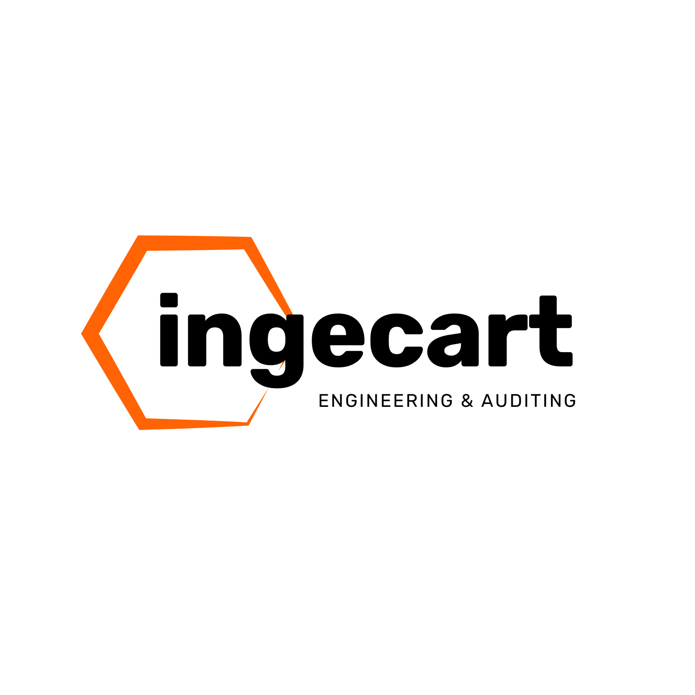
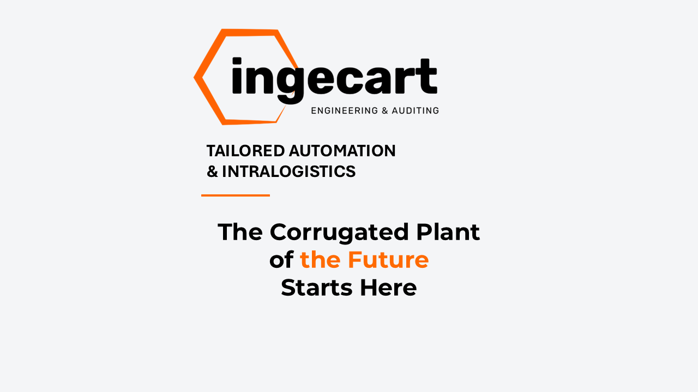

# BROCHURE COMERCIAL
## Ingecart en FESPA 2026

---

## Menos Friccion Operativa. Mas Produccion Util.

Ingecart ayuda a plantas de carton corrugado y packaging a convertir cuellos de botella en ventaja operativa.

Que hacemos:
- Automatizacion de final de linea
- Intralogistica de bobinas y cargas
- Gestion energeticamente eficiente de retal
- AMR para flujos flexibles
- Inteligencia operativa con Ing_PRO

---

## Soluciones Destacadas

### Paletizer + Easy Pack
Automatiza apilado y embalado para salida estable y menor retrabajo.

### Sistema Retal SR1400
Integra la evacuacion de desperdicio con alta eficiencia energetica.

### Ingetrans 2800
Automatiza entrega y retorno de bobinas, reduciendo trafico de carretillas en zona critica.

### AMR
Movilidad autonoma sin infraestructura fija para plantas con cambios de layout.

### Ing_PRO
Copiloto industrial: de insight a accion en operacion y mantenimiento.

---

## Por que Ingecart

- Ingenieria independiente de fabricante
- Proyectos a medida orientados a KPI
- Integracion real en planta, no teoria
- Soporte tecnico desde auditoria hasta operacion estable

Cifras de referencia:
- 28 anos de experiencia
- 1.268 proyectos
- 26 acuerdos internacionales
- 194 instalaciones activas

---

## Conversacion de 15 minutos en stand

Si quiere, en la feria revisamos:
1. Su principal cuello de botella actual
2. La solucion con menor riesgo de implantacion
3. Un ROI preliminar sobre sus datos base

CTA:
"Escanee el QR y agende su mini diagnostico post-feria."

Contacto:
- Web: www.ingecart.eu
- Booking: www.ingecart.eu/book-online
- Email: hablemos@ingecart.eu
- Tel: +34 938 183 316
