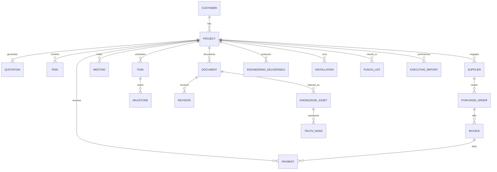

ENTERPRISE RELATIONSHIP MODEL

Purpose
-------
Visualize canonical relationships between Enterprise Objects and map current repository evidence to each relation. This diagram is the reference for API design, Graph ingestion and reporting.

Mermaid ER diagram (core relationships)

Mapping to repository evidence
- CUSTOMER → PROJECT
  - Evidence: clients/projects exist in [erp_facturacion/erp.py](erp_facturacion/erp.py) and Closeout `projects` ([services/project_closeout_service.py](services/project_closeout_service.py)).

- PROJECT → DOCUMENT
  - Evidence: Closeout save_document writes `documents` in [services/project_closeout_service.py](services/project_closeout_service.py); ERP stores `documents` table in [erp_facturacion/erp.py](erp_facturacion/erp.py).

- SUPPLIER → PURCHASE_ORDER → INVOICE → PAYMENT
  - Evidence: `suppliers`, `purchase_orders`, `invoice_headers`, `payments` present in [erp_facturacion/erp.py](erp_facturacion/erp.py).

- PROJECT → TASK / MILESTONE
  - Evidence: Missing in repository (TASK/MILESTONE tables not present). See reports/PROJECT_DATA_MODEL_V2.md for recommended schema.

- DOCUMENT → KNOWLEDGE_ASSET → TRUTH_NODE
  - Evidence: KnowledgeMemory stores `knowledge_items` including `project` ([agents/knowledge_intelligence/memory/knowledge_memory.py](agents/knowledge_intelligence/memory/knowledge_memory.py)); GraphStore models documents but not project nodes ([backoffice/graph/store.py](backoffice/graph/store.py)).

Observations (consistency & gaps)
- Multiple data silos: ERP and Closeout each maintain `projects` and `documents` — this duplicates canonical entities and risks inconsistencies.
- GraphStore lacks `project` node type — truth graph cannot fully represent project-scoped relations yet.
- Tasks, milestones, resource assignments are missing and must be added to complete the relationship model.

Implications for implementation
- Before any heavy development, establish canonical `projects` and `documents` in Project Registry, and ensure ingestion pipelines write `graph_nodes` and `graph_edges` with `project_id` metadata.
- Provide mapping services that translate existing ERP/Closeout tables into canonical nodes so the truth graph and Knowledge Hub can be built incrementally.
