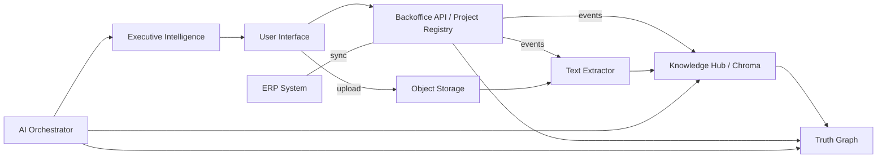

PROJECT REGISTRY — ARCHITECTURE V2

Purpose
-------
Define the architecture that makes `Project` the Single Source of Truth (SSoT) across the platform. This document explains components, dataflows, integration patterns and a migration approach so Project Management becomes the operational backbone of the Enterprise OS.

Principles
----------
- Single canonical Project ID (canonical_project_id) for every artifact.
- Event-driven, idempotent, auditable integrations.
- Keep existing functionality (backward compatible) while incrementally extending.
- Store structured project data in a transactional DB; store large objects in object storage and index content in Knowledge Hub + Vector DB.
- Truth Graph contains canonical project node with rich edges to other entities.

High-level components
---------------------
- Project Registry (central service + DB)
  - Exposes CRUD and search APIs for projects and related entities.
  - Emits events on create/update/delete (Kafka/Redis streams or lightweight queue).
- API Gateway / Backoffice API
  - Routes UI and agent requests to services.
- ERP Adapter / Synchroniser
  - Two-way sync adapter to keep ERP customers/suppliers/invoices/POs/payments mapped to canonical_project_id.
- Knowledge Hub Ingest Pipeline
  - Text extractor → metadata extractor → indexer (KnowledgeMemory / Chroma) with `project` metadata.
- Truth Graph Engine
  - Graph store (Graph DB or adjacency tables + in-memory GraphStore) that stores `project` node + typed edges (document_of, invoice_for, risk_of, etc.).
- AI Orchestrator
  - Routes user queries through a controlled pipeline (see Orchestrator contract). Reads from Knowledge Hub and Truth Graph; returns evaluated outputs with evidence.
- Executive Intelligence / Reporting
  - Consumes canonical data and analytics to produce executive reports automatically.
- Document Store
  - Object storage (S3-compatible recommended) for binary artifacts; metadata in DB.

Dataflow (summary)
------------------
1. Project creation/upsert via UI/API or ERP → Project Registry stores canonical_project_id and emits `project.created`/`updated` event.
2. Consumers (ERP adapter, Knowledge Hub, Truth Graph ingester, analytics) subscribe to events and perform domain-specific actions: map ERP IDs, index documents, create graph nodes, recalculate health score.
3. Document uploads (UI or automated ingestion) are stored in Object Storage; extractor produces text + entities; indexer stores metadata with `project_id` in KnowledgeMemory and adds document node + edge into Truth Graph.
4. AI Orchestrator processes user prompts by calling the Context Router → Project Resolver → Knowledge Hub + Truth Graph → Evidence Ranking → Fact Checker → Executive Report Generator pipeline. Orchestrator returns outputs with references and confidence.

Mermaid: High-level flow

Integration patterns
--------------------
- Event-driven near-real-time: create/update/delete events, document_ingested events.
- Idempotent operations: all events include `source` and `source_id` to allow de-dup and safe retries.
- Dual-write & reconciliation: for migration phases, Project Registry accepts `external_ids` mapping and will reconcile ERP and Closeout entries.
- Backfill / bulk import: offline jobs to backfill Knowledge Hub and Truth Graph from historical artifacts.

API contract (minimum)
----------------------
- GET /projects
- POST /projects { canonical_project_id?, name, code, external_ids:{erp: 'ERP-123'}, customer_id, metadata }
- GET /projects/{id}
- PATCH /projects/{id}
- POST /projects/{id}/documents { file, doc_type, source, tags }
- GET /projects/{id}/health
- POST /projects/{id}/events { type, payload }

Example project payload (API)
-----------------------------
{
  "canonical_project_id": "PRJ-2026-001",
  "name": "ACME Corrugator Line",
  "code": "ACME-CL-001",
  "external_ids": {"erp": "ERP-12345", "closeout": "DEMO-001"},
  "customer_id": "CL-ACME",
  "start_date": "2026-02-01",
  "end_date": "2026-11-30",
  "tags": ["corrugator","pilot"],
  "metadata": {"plant":"Seville","equipment":"SR1400"}
}

Observability & audit
---------------------
- Every change must record `changed_by`, `source`, `source_id`, `trace_id` and `changed_at`.
- Emit metrics: events/sec, indexing latency, failed_ingests.
- Store audit log in append-only table (or cloud audit service).

Security & governance
---------------------
- RBAC on Project-level actions (view/edit/approve).
- Signed event payloads for cross-system integrity (optional HMAC).

Backward compatibility
----------------------
- Keep `services/project_closeout_service.py` behavior: introduce `canonical_project_id` column and write mapping during migration.
- Expose compatibility endpoints to query legacy `project_closeout` DB by canonical id.

Migration approach (incremental)
-------------------------------
1. Create Project Registry schema and API (read-only for ERP and Closeout).
2. Backfill Project Registry with current Closeout projects and record mapping in `external_ids.closeout`.
3. Implement ERP adapter to reconcile ERP `projects` into Project Registry (do not overwrite human-edits; create new mapping entries).
4. Enable event publishing and hook Knowledge Hub ingesters.
5. Switch UI to read canonical_project_id and progressively rewrite callers to use canonical id.

Files in repo to reference / extend during implementation
------------------------------------------------------
- pages/project_closeout.py (current UI)
- services/project_closeout_service.py (current local persistence)
- erp_facturacion/erp.py (ERP schema and helpers)
- agents/knowledge_intelligence/memory/knowledge_memory.py (Knowledge Memory ingestion pattern)
- backoffice/graph/store.py (Truth Graph primitives)
- backoffice/agents/orchestrator.py and agents/knowledge_intelligence/orchestrator.py (AI Orchestrator patterns)

Next docs: PROJECT_DATA_MODEL_V2.md, PROJECT_DATABASE_SCHEMA_V2.md, PROJECT_UI_WIREFRAMES_V2.md, PROJECT_IMPLEMENTATION_PLAN_V2.md
