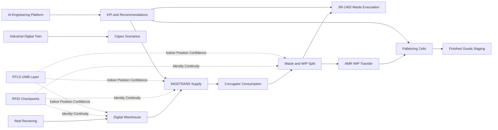

# ESTESA Architecture Annex

Date: 2026-07-24

## A. Reference Architecture

The target architecture combines mechanical automation, intralogistics orchestration, and digital intelligence:

1. Physical handling layer
- INGETRANS rail-based reel transport
- AMR routes for waste and WIP flows
- SR-1400 engineered waste evacuation
- Palletizing cells (Heavy Duty and Plug and Play)

2. Traceability and control layer
- Digital Warehouse as inventory and location plane
- RFID checkpoints for identity continuity
- RTLS for indoor positioning confidence

3. Intelligence and decision layer
- Industrial Digital Twin for pre-capex and what-if validation
- AI Engineering Platform for runtime diagnostics and optimization

## B. Logical Flow Diagram

## C. Integration Interfaces

- Interface I1: ERP/MES to Digital Warehouse transaction events.
- Interface I2: Digital Warehouse to INGETRANS dispatch and return logic.
- Interface I3: RFID/RTLS event stream to material genealogy and reconciliation.
- Interface I4: AMR fleet manager to waste/WIP orchestration events.
- Interface I5: Palletizer telemetry to AI KPI layer.
- Interface I6: Digital Twin model inputs from measured production and logistics parameters.

## D. Architecture Risks and Controls

- Risk: fragmented event models across logistics and traceability subsystems.
  - Control: canonical event schema with plant-wide identifier policy.
- Risk: overpromised throughput without interface-level validation.
  - Control: pre-FAT simulation and measurable acceptance criteria.
- Risk: unclear ownership after handover.
  - Control: RACI matrix and SLA-linked service boundaries.

## E. Evolution Path

1. Phase 1: core flow stabilization (INGETRANS + SR-1400 + baseline RFID).
2. Phase 2: AMR expansion and warehouse digitalization.
3. Phase 3: Digital Twin and AI closed-loop optimization.
4. Phase 4: multi-plant replication and governance standardization.
